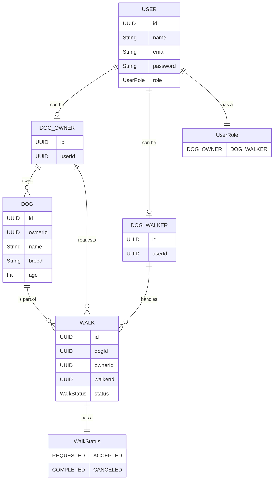

# API Lifecycle

- [API Lifecycle](#api-lifecycle)
  - [Requirements](#requirements)
  - [Domain Model](#domain-model)
    - [ER Diagram](#er-diagram)
    - [Stories](#stories)
    - [Scenarios](#scenarios)
  - [API Contract](#api-contract)
  - [Parallel Implementation](#parallel-implementation)

## Requirements

| Type  | Requirement  | In Plan |
|---|---|---|
| Functional  | Sign up as a dog walker or a dog owner  |   |
| Functional  | Dog walkers can own and complete walks  |   |
| Functional  | Dog owners can request walks  |   |
| NonFunctional  | Needs to be cheap  |   |
| NonFunctional  | Contract driven to parallelise the front end and back end work  |   |
| NonFunctional  | Needs to be API driven so behaviour available for other UIs  |   |
| NonFunctional  | MVP needed for christmas  |   |

## Domain Model

### ER Diagram

### Stories

As a user I want to sign up as a dog walker or a dog owner so that I can use the app.

As a dog walker I want to accept and complete walks so that I can earn money.

Given I have accepted a walk I should see the walk in my list of walks.

Given I have accepted a walk I should be able to cancel the walk.

As a dog owner I want to be able to register my dog so that I can request walks.

Given I have registered my dog I want to request walks so that my dog can be walked.

Given I have requested a walk I should be able to see the status of the walk.

Given I have requested a walk I should be able to cancel the walk.

### Scenarios

## API Contract

## Parallel Implementation
