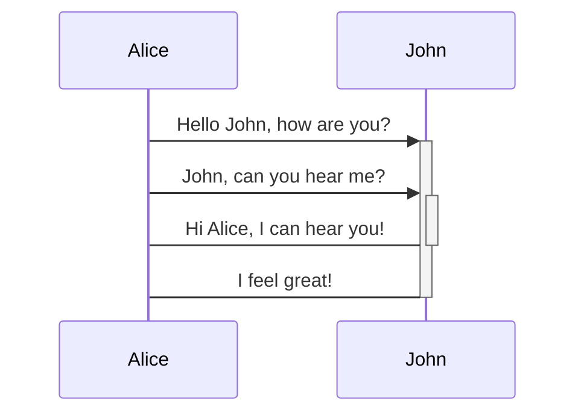

import ApiLogo from "@theme/ApiLogo";
import Heading from "@theme/Heading";
import SchemaTabs from "@theme/SchemaTabs";
import TabItem from "@theme/TabItem";
import Export from "@theme/ApiExplorer/Export";

<Export
  url={"../../contracts/whiskey/whiskey.oas.0.0.yaml"}
  proxy={undefined}
>
  
</Export>

<Heading
  as={"h1"}
  className={"openapi__heading"}
  children={"Whiskey API"}
>
</Heading>

## Whiskey API

This is the whiskey API provided by Hungovercoders.

These are the services levels available:

  <Heading
    id={"authentication"}
    as={"h2"}
    className={"openapi-tabs__heading"}
    children={"Authentication"}
  >
  </Heading><SchemaTabs
    className={"openapi-tabs__security-schemes"}
  >
    <TabItem
      label={"API Key: apiKey"}
      value={"apiKey"}
    >
      
      
      API Key
      
      

        <table>
          <tbody>
            <tr>
              <th>
                Security Scheme Type:
              </th><td>
                apiKey
              </td>
            </tr><tr>
              <th>
                Header parameter name:
              </th><td>
                api-key
              </td>
            </tr>
          </tbody>
        </table>
      

    </TabItem><TabItem
      label={"HTTP: Basic Auth"}
      value={"basicAuth"}
    >
      
      
      Basic Authentication
      
      

        <table>
          <tbody>
            <tr>
              <th>
                Security Scheme Type:
              </th><td>
                http
              </td>
            </tr><tr>
              <th>
                HTTP Authorization Scheme:
              </th><td>
                basic
              </td>
            </tr>
          </tbody>
        </table>
      

    </TabItem>
  </SchemaTabs>

      